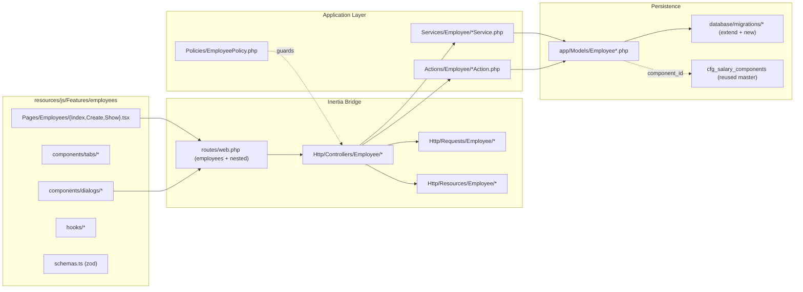

# Employee Feature Port — Implementation Plan

> **For agentic workers:** Use `superpowers:subagent-driven-development` (recommended) or `superpowers:executing-plans` to implement this task-by-task. After phase H, dispatch the `laravel-port-guardrail` subagent (`.claude/agents/laravel-port-guardrail.md`) for a PASS/FAIL phase gate review before claiming complete.

**Active phase:** Phase 1 — Core (Employee).
**Reference UI (read-only):** `/Users/ade/Sites/hr-uiux/src/components/employees/` and `/Users/ade/Sites/hr-uiux/src/pages/EmployeeDetail.tsx`.
**Master discovery spec:** `../../HRIS/product-discovery/output/prompt/coding/02-laravel-vite-port-from-loveable-phased.md`.

---

## Architecture

**Conventions** (enforced by `.cursor/rules/10-migrations-and-models.mdc`):
- Prefixed tables (`emp_*`, `cfg_*`); `string()` for status/type (no `enum`); `decimal(18,2)` money; `decimal(7,4)` percentage; `cascadeOnDelete` on child rows; soft deletes on master/employee tables; no hard-coded BPJS/PPh21 rates.
- Every Indonesian-HR field touch (`nik`, `npwp`, `bpjs_*`, `tax_status`, `tax_method`, `contract_type`) routes through `hr-research-indonesia` skill or the new Cursor subagent for citation.

---

## File Structure

### Backend (new + modified)

- `app/Services/Employee/EmployeeService.php` — master CRUD orchestration, transactional save.
- `app/Services/Employee/EmployeeQueryService.php` — list/filter/search/paginate, eager loads.
- `app/Services/Employee/EmployeeIdentityService.php`, `EmployeeFamilyService.php`, `EmployeeEmergencyContactService.php`, `EmployeeBankAccountService.php`, `EmployeeTaxProfileService.php`, `EmployeeAllowanceService.php`, `EmployeeDeductionService.php`, `EmployeeDocumentService.php`.
- `app/Actions/Employee/ArchiveEmployeeAction.php`, `RestoreEmployeeAction.php`, `LinkEmployeeUserAction.php`, `UploadEmployeePhotoAction.php`, `ImportEmployeesAction.php`, `ExportEmployeesAction.php`.
- `app/Http/Controllers/EmployeeController.php` — refactored thin controller.
- `app/Http/Controllers/Employee/{Identity,Family,EmergencyContact,BankAccount,TaxProfile,Allowance,Deduction,Document,Photo,Archive,BulkAction,ImportExport}Controller.php`.
- `app/Http/Requests/Employee/*` — one Store/Update Request per resource (~18 files).
- `app/Http/Resources/Employee/*` — `EmployeeResource`, `EmployeeSummaryResource`, plus one per sub-resource.
- `app/Policies/EmployeePolicy.php` — `viewAny|view|create|update|archive|restore|bulkUpdate|import|export`.
- `app/Models/EmployeeDeduction.php`, `EmployeeDocument.php` — new models; extend `EmployeeAllowance`, `EmployeeTaxProfile`, `Employee`.
- `database/migrations/2026_06_01_000001_extend_emp_allowances_for_catalog.php`.
- `database/migrations/2026_06_01_000002_create_emp_deductions_table.php`.
- `database/migrations/2026_06_01_000003_extend_emp_tax_profiles_table.php`.
- `database/migrations/2026_06_01_000004_extend_emp_employees_photo_user.php`.
- `database/migrations/2026_06_01_000005_create_emp_documents_table.php`.
- `database/factories/EmployeeDeductionFactory.php`, `EmployeeDocumentFactory.php`, extensions to existing factories.
- `database/seeders/HrisIndonesiaDemoSeeder.php` — extend to also seed identity, family, bank, tax profile for the 500 demo employees.
- `routes/web.php` — nested `Route::resource(...)` for each sub-resource under `employees/{employee}/...`.

### Frontend (new + modified)

- `resources/js/Pages/Employees/Index.tsx` — list with filters, search, status chips, bulk action bar, import/export buttons.
- `resources/js/Pages/Employees/Create.tsx` — uses `EmployeeFormDialog` rendered as a full-page sheet for create.
- `resources/js/Pages/Employees/Show.tsx` — `EmployeeProfileTabs` host. (Edit page **removed** — edits happen in dialogs from Show.)
- `resources/js/Features/employees/types.ts`, `schemas.ts` (zod), `api.ts` (typed Inertia request wrappers).
- `resources/js/Features/employees/components/EmployeeTable.tsx`, `EmployeeFilters.tsx`, `EmployeeStatusBadge.tsx`, `EmployeeAvatar.tsx`, `EmployeeBulkActions.tsx`, `EmployeeProfileTabs.tsx`, `EmployeeProfileHeader.tsx`.
- `resources/js/Features/employees/components/tabs/PersonalTab.tsx`, `EmploymentTab.tsx`, `FamilyTab.tsx`, `PayrollTab.tsx`, `DocumentsTab.tsx`.
- `resources/js/Features/employees/components/dialogs/EmployeeFormDialog.tsx` (create), `EditEmployeeDialog.tsx` (NEW — closes hr-uiux gap), `IdentityFormDialog.tsx`, `FamilyMemberFormDialog.tsx`, `EmergencyContactFormDialog.tsx`, `BankAccountFormDialog.tsx`, `TaxProfileFormDialog.tsx`, `AllowanceFormDialog.tsx`, `DeductionFormDialog.tsx`, `DocumentUploadDialog.tsx`, `PhotoUploadDialog.tsx`, `ArchiveConfirmDialog.tsx`, `ImportEmployeesDialog.tsx`.
- `resources/js/Features/employees/components/forms/sections/` — reusable form sections (`PersonalSection`, `EmploymentSection`, `SalarySection`, `TaxSection`) shared between Create and Edit dialogs.
- `resources/js/Features/employees/hooks/useEmployeeForm.ts`, `useEmployeeFilters.ts`, `useBulkSelection.ts`.

### Guardrail / docs (new)

- `.cursor/agents/hr-research-indonesia.md` — Cursor-native HR Indonesia research subagent mirroring `.claude/agents/hr-researcher-indonesia.md`.
- `docs/superpowers/plans/2026-06-01-employee-feature-port.md` — saved copy of this plan for subagent-driven execution.

---

## Phases & Tasks

### Phase A — Schema alignment (migrations + models)

- **Task A1**: TDD — write a feature test `tests/Feature/Employee/SchemaAlignmentTest.php` that asserts: `emp_allowances` has `component_id`, `taxable`, `effective_start`, `effective_end`, `status`, `recurring`; `emp_deductions` table exists with same shape; `emp_tax_profiles` has `has_npwp`, `tax_method`, `npwp`; `emp_employees` has `profile_photo_path`, `user_id`; `emp_documents` exists. Run, watch red.
- **Task A2**: Create the 5 migrations listed above with correct `down()` reverse-FK order. Confirm `php artisan migrate:rollback && php artisan migrate` round-trips.
- **Task A3**: Update models — add `EmployeeDeduction`, `EmployeeDocument`; extend `EmployeeAllowance`, `EmployeeTaxProfile`, `Employee` with new fields, relationships (`component()`, `documents()`, `deductions()`, `user()`), casts.
- **Task A4**: Update factories + extend `HrisIndonesiaDemoSeeder` to seed identity (NIK/NPWP/BPJS), one family member, one bank account, one tax profile per demo employee. Run schema test → green. Commit.

### Phase B — Backend foundation (Services, Actions, Requests, Resources, Policy)

- **Task B1**: TDD — write `tests/Unit/Services/Employee/EmployeeServiceTest.php` covering `create()`, `update()`, transactional rollback on child-insert failure. Red.
- **Task B2**: Implement `EmployeeService` + `EmployeeQueryService` with DB transactions and eager-load helpers. Green.
- **Task B3**: Implement the 8 sub-resource Services (Identity, Family, EmergencyContact, BankAccount, TaxProfile, Allowance, Deduction, Document) — each exposing `list($employee)`, `create($employee, $data)`, `update($model, $data)`, `delete($model)`. TDD each with a small unit test.
- **Task B4**: Implement Actions (`ArchiveEmployeeAction`, `RestoreEmployeeAction`, `LinkEmployeeUserAction`, `UploadEmployeePhotoAction`, `ImportEmployeesAction`, `ExportEmployeesAction`). Each is an invokable class.
- **Task B5**: Generate Form Requests under `app/Http/Requests/Employee/`. Indonesian-validated fields (`nik` 16-digit numeric, `npwp` format `00.000.000.0-000.000`, `tax_status` ∈ {TK/0..3,K/0..3}, `bpjs_health`/`bpjs_employment` numeric) MUST cite source via the `hr-research-indonesia` skill in the rule docblock.
- **Task B6**: Generate API Resources under `app/Http/Resources/Employee/`. `EmployeeResource` includes nested resources when loaded.
- **Task B7**: Implement `app/Policies/EmployeePolicy.php` and register in `AuthServiceProvider`. Wire `authorizeResource` in controllers.
- **Task B8**: Commit per service/action group.

### Phase C — Controllers + routes (refactor + nested)

- **Task C1**: Refactor `app/Http/Controllers/EmployeeController.php` to use `EmployeeService` + `EmployeeQueryService` + Form Requests + Resources. Add `destroy()` (calls `ArchiveEmployeeAction`).
- **Task C2**: Create the 12 nested controllers under `app/Http/Controllers/Employee/`. Each is a thin Inertia/JSON controller delegating to its Service.
- **Task C3**: Update `routes/web.php` — nested `Route::resource('employees.identity', ...)->only(['store','update','destroy'])` and similar for each sub-resource. Add `Route::post('employees/bulk', ...)`, `Route::post('employees/import', ...)`, `Route::get('employees/export', ...)`, `Route::patch('employees/{employee}/archive', ...)`, `Route::patch('employees/{employee}/restore', ...)`, `Route::post('employees/{employee}/photo', ...)`, `Route::post('employees/{employee}/link-user', ...)`.
- **Task C4**: TDD — `tests/Feature/Employee/{Identity,Family,EmergencyContact,BankAccount,TaxProfile,Allowance,Deduction,Document,Archive,BulkAction,ImportExport,Photo}ControllerTest.php`. Each covers happy path + validation + policy denial. Red → implement → green. Commit per controller.

### Phase D — Frontend foundation (feature folder, shared primitives)

- **Task D1**: Create `resources/js/Features/employees/types.ts` (TypeScript types matching API Resources), `schemas.ts` (zod schemas matching Form Request rules), `api.ts` (typed Inertia router wrappers).
- **Task D2**: Build reusable atoms: `EmployeeStatusBadge.tsx`, `EmployeeAvatar.tsx`, `IndonesianFieldFormatters.ts` (NIK/NPWP display masking).
- **Task D3**: Build reusable form sections under `components/forms/sections/` (Personal, Employment, Salary, Tax). Each section accepts a `react-hook-form` `control` prop and is composed into both create and edit dialogs (DRY).
- **Task D4**: Build the `EmployeeFormDialog` (create) using react-hook-form + zod, composing the shared sections. Visual parity with `/Users/ade/Sites/hr-uiux/src/components/employees/EmployeeFormDialog.tsx`.
- **Task D5**: Build the `EditEmployeeDialog` (NEW — the missing-feature you flagged): same shared sections but pre-filled, with optimistic updates via Inertia `router.patch`. This is the hr-uiux gap closed.

### Phase E — Profile tabs + sub-resource dialogs

- **Task E1**: Build `EmployeeProfileHeader.tsx` (avatar, name, code, status badge, archive/edit/photo buttons) and `EmployeeProfileTabs.tsx`.
- **Task E2**: Build `PersonalTab.tsx` — shows personal fields + `EditEmployeeDialog` trigger + identity card with `IdentityFormDialog` CRUD.
- **Task E3**: Build `EmploymentTab.tsx` — shows current job, history, contracts list (links to `/contracts` module); inline assign/edit via `EmployeeJob` future endpoint (out of scope — defer with link).
- **Task E4**: Build `FamilyTab.tsx` — FamilyMember list with add/edit/delete via `FamilyMemberFormDialog`; EmergencyContact card with `EmergencyContactFormDialog`.
- **Task E5**: Build `PayrollTab.tsx` — Bank account card with `BankAccountFormDialog`; Tax profile card with `TaxProfileFormDialog` (extend to include `has_npwp`, `tax_method`); Allowances table with `AllowanceFormDialog` (catalog dropdown from `cfg_salary_components`); Deductions table with `DeductionFormDialog`; estimated gross/net summary; recent payrolls table.
- **Task E6**: Build `DocumentsTab.tsx` — file list + `DocumentUploadDialog` (categories: KTP scan, NPWP scan, contract, certificate, other). Storage on `local`/`public` disk.
- **Task E7**: Wire `Show.tsx` to mount `EmployeeProfileHeader` + `EmployeeProfileTabs`. Verify tab parity against `/Users/ade/Sites/hr-uiux/src/pages/EmployeeDetail.tsx`.

### Phase F — Bulk, import/export, photo, archive, user link

- **Task F1**: Add `EmployeeBulkActions.tsx` bar in `Index.tsx` (multi-select rows + bulk archive / bulk status change / bulk export selected).
- **Task F2**: Build `ImportEmployeesDialog.tsx` — CSV upload with column mapping preview, server-side dry-run validation, commit on confirm. Service: `ImportEmployeesAction` uses Laravel Excel or native fgetcsv (avoid new dep unless asked).
- **Task F3**: Add CSV export button on Index — streams via `ExportEmployeesAction`.
- **Task F4**: Build `PhotoUploadDialog.tsx` — crop preview + upload to `storage/app/public/employees/photos/`. Update `profile_photo_path`.
- **Task F5**: Build `ArchiveConfirmDialog.tsx` — confirms soft delete. Add restore action on archived list view.
- **Task F6**: Add "Link to user account" panel in PersonalTab — search existing users + assign `user_id`.

### Phase G — Cursor-native HR Indonesia subagent

- **Task G1**: Create `.cursor/agents/hr-research-indonesia.md` with frontmatter `name: hr-research-indonesia`, description triggering on Indonesian terms (PKWT, PKWTT, BPJS, PPh21, NIK, NPWP, TER, PTKP, THR, alih daya, pesangon, JHT/JP/JKK/JKM/JKP, UMP/UMK). Body mirrors the discipline of `.claude/agents/hr-researcher-indonesia.md`: regulation citation (UU/PP/PMK + pasal + effective date), edge cases, do-not-invent rules, do-not-hard-code rates rule.
- **Task G2**: Cross-reference: add a docblock pointer in `EmployeeIdentityService.php`, `EmployeeTaxProfileService.php`, and the validation rules in `app/Http/Requests/Employee/*` requesting the subagent for any rule changes.
- **Task G3**: Smoke-test the subagent by asking it "What's the current PTKP table?" and verify it returns regulation-cited answer (PMK 168/2023). Document the smoke-test outcome in the completion report.

### Phase H — Verification + phase gate

- **Task H1**: Run full suite: `php artisan migrate:rollback && php artisan migrate && php artisan test`. All green.
- **Task H2**: Run `npm run build`. No type errors.
- **Task H3**: Build the parity checklist (rows: every hr-uiux employee file/dialog/tab → Laravel route + handler + status). Save to `docs/superpowers/plans/2026-06-01-employee-feature-port.md` appendix.
- **Task H4**: Fill the laravel-port-guardrail completion report template. Dispatch the `.claude/agents/laravel-port-guardrail.md` subagent for PASS/FAIL review with the parity checklist + verification output. Address any FAILs.
- **Task H5**: Final commit + summary.

---

## DRY / YAGNI / testing notes

- **DRY:** All form sections (`PersonalSection`, `EmploymentSection`, `SalarySection`, `TaxSection`) are written once in `components/forms/sections/` and reused by Create + Edit dialogs. Field validators come from a single zod schema in `Features/employees/schemas.ts`; back-end Form Requests use the same regex/enums sourced from a single `app/Support/Indonesia/IdValidators.php` helper.
- **YAGNI:** Do **not** add `emp_education_history` or `emp_work_experience` tables — they are not in the hr-uiux scope or the schema reference. Contracts UI stays in the existing `/contracts` module; the Employment tab only **links** to it. No multi-tenant global scope (per `.cursor/rules/00-laravel-codebase.mdc`).
- **TDD:** Each task starts red. Pest is not wired; use PHPUnit feature/unit tests under `tests/Feature/Employee/` and `tests/Unit/Services/Employee/`.
- **No hard-coded statutory rates** — Tax profile dialog reads PTKP and BPJS values from `cfg_tax_rules` / `cfg_bpjs` / `cfg_salary_components`. If a rate is missing, surface "configuration missing" rather than inline a number (laravel-port-guardrail rule).

---

## Out-of-scope (deferred — do NOT implement)

- Multi-tenant global scope middleware.
- Employee contracts CRUD (kept in `/contracts` module; only linked from the Employment tab).
- Education history / Work experience tables.
- WebSocket presence on the list.
- Mobile app endpoints (Sanctum-tokened API).
- Recruitment hire flow rewrite — keep existing `Recruitment/PipelineController::hire`.

If a request would push past these, stop and surface (per `.cursor/rules/00-laravel-codebase.mdc`).

---

## Execution handoff

After approval, save this plan to `docs/superpowers/plans/2026-06-01-employee-feature-port.md` and execute with `superpowers:subagent-driven-development` (one subagent per Task, two-stage review per the skill). Dispatch `laravel-port-guardrail` (`.claude/agents/laravel-port-guardrail.md`) at the H4 phase gate before claiming complete.
