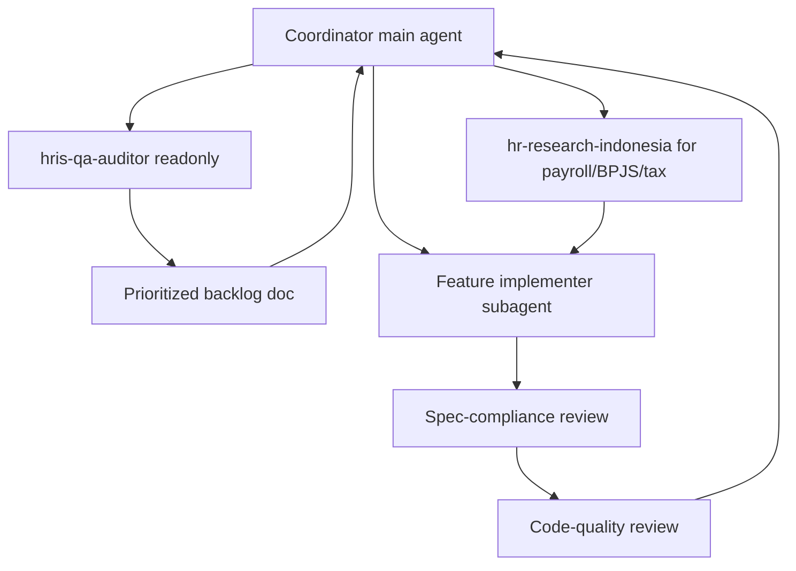

# HRIS Completion via an Agent Team

## Goal
Bring the Laravel HRIS at `/Users/ade/Sites/hris/` to a complete state: (1) a Cursor-based agent "team" that audits and drives the work, (2) a comprehensive Indonesian demo dataset pushed additively into `apps_hris` MySQL, and (3) full implementation of every missing/placeholder feature, with payroll made Indonesia-compliance-grade. The QA/reviewer agent produces the prioritized backlog and the team follows it.

## How the "team" works in Cursor
Cursor agents don't peer-to-peer chat; a **coordinator** (the main agent) dispatches specialized **subagents** via the Task tool and gates their output. This is the `subagent-driven-development` pattern.

## Current-state findings (seed for the backlog)
- Strong/working: Employees, Org, Contracts, Shifts, Leave requests/approvals, Recruitment (jobs/candidates/pipeline), Outsourcing core, Admin/RBAC.
- Placeholders (all render one `resources/js/Pages/Talent/Placeholder.tsx` via `app/Http/Controllers/Talent/TalentModuleController.php`): Performance, Training, Talent Pool, Succession, Nine-Box, Recruitment Interviews.
- Read-only/preview: Leave Balance & Types, Vendor Billing, Outsourcing Compliance, Dashboard charts (hardcoded in `resources/js/Pages/Dashboard.tsx`), header global search.
- Schema-only (no UI/routes): Overtime (`ot_overtimes`), Loans (`emp_loans`), employee Jobs/Site history CRUD, SaaS billing (`sys_tenants`/`sub_plans`/`sub_subscriptions`/`bill_payments`), BPJS/tax config admin (`cfg_bpjs`/`cfg_tax_rules`).
- Payroll: `app/Services/Payroll/PayrollCalculationService.php` is simplified (flat 5% PPh21, 4% BPJS; ignores allowances/deductions/loans/THR).
- Demo data: `database/seeders/HrisIndonesiaDemoSeeder.php` seeds ~500 employees + attendance + payroll, but ~28 business tables stay empty.

## Phase 0 — Agent team & QA infrastructure (Cursor ecosystem)
- Add `.cursor/skills/hris-qa-audit/SKILL.md`: how to audit modules vs the blueprint, classify gaps (severity, module, acceptance criteria), and emit a prioritized backlog markdown file (e.g. `docs/qa/missing-features-backlog.md`).
- Add `.cursor/skills/hris-feature-delivery/SKILL.md`: the end-to-end recipe to ship one HRIS module — migration -> model -> controller -> route + `app/Support/PermissionCatalog.php` permission -> Form Request -> Inertia page + `resources/js/Components/layout/AppSidebar.tsx` nav + `resources/js/i18n/translations.ts` (EN/ID) -> demo seeder rows -> test. Routes payroll/HR-law questions to `hr-research-indonesia`.
- Add `.cursor/agents/hris-qa-auditor.md`: read-only dispatchable reviewer (mirrors the audit skill; `Read/Grep/Glob` only), matching the existing `.cursor/agents/hr-research-indonesia.md` convention.
- Register the new skills/agents in `AGENTS.md` and a short `.cursor/rules` pointer.
- Run the auditor once to produce/commit the prioritized backlog (this is the requested "todo list for missing actions").

## Phase 1 — Comprehensive demo data (additive, run now)
Extend `HrisIndonesiaDemoSeeder` (or add seeder classes it calls) using Faker `id_ID` via `database/seeders/Support/IndonesianDemoData.php`. Idempotent per-table guards, bulk inserts, no wiping. Fill the empty tables:
- Salary catalog first: `cfg_salary_components` (transport, meal, position, BPJS deductions), then `emp_allowances` + `emp_deductions` linked to it.
- `emp_emergency_contacts`, `emp_documents` (placeholder paths), `emp_loans` (subset).
- `emp_contracts` (PKWT/PKWTT mix, some expiring soon for reminders).
- `att_shifts` (pagi/siang/malam) + `rel_employee_shifts` assignments.
- `lv_leaves` (mixed statuses, aligned with attendance leave days) + `ot_overtimes` (subset, with approvers).
- Recruitment: `trx_jobs` / `trx_candidates` / `trx_applications` across pipeline stages.
- Outsourcing: vendor `org_companies` (type=vendor) + `rel_vendor_employees` placements.
- Config completeness: full `cfg_bpjs` set (add jkk/jkm/jkp) + `cfg_tax_rules` TER brackets (values via hr-research).
- SaaS: `sys_tenants` / `sub_plans` / `sub_subscriptions` / `bill_payments`; `sys_settings` defaults.
- Link `emp_employees.user_id` to ESS `users` for a subset.
- Verify with `php artisan migrate` + `php artisan db:seed --class=HrisIndonesiaDemoSeeder` against `apps_hris`. Never `migrate:fresh` (per `.cursor/rules/05-database-safety.mdc`).

## Phase 2..N — Implement missing features (follow QA backlog, QA-gated)
Each module: build end-to-end per the feature-delivery skill, add demo rows for the new tables, then pass spec + code-quality review before moving on.
- Payroll compliance-grade: rewrite `PayrollCalculationService` for PPh21 TER (PMK 168/2023), full BPJS (JHT/JP/JKK/JKM/JKP + Kesehatan), pull `emp_allowances`/`emp_deductions`/`emp_loans`, THR; add admin CRUD for `cfg_bpjs` + `cfg_tax_rules`. Rates/brackets sourced via `hr-research-indonesia`.
- Core ops: Overtime (PP 35/2021), Loans, Leave entitlement/accrual engine (replace hardcoded `LeaveController::TYPES` + computed balance), employee Jobs/Site history CRUD, attendance edit/delete + shift-status integration. Wire orphan permissions in `PermissionCatalog.php`.
- Talent layer (new tables + models + controllers + Inertia pages, replacing `Talent/Placeholder`): Performance, Training, Talent Pool, Succession, Nine-Box.
- Recruitment Interviews (new table) + make pipeline "hire" create contract + `emp_jobs` + site assignment.
- Outsourcing: vendor invoice/billing persistence, compliance resolve/acknowledge workflow, placement update.
- SaaS billing admin: tenants/plans/subscriptions/payments.
- Dashboard real charts + activity feed, functional global search, notification lists in `AppHeader.tsx`.

## Verification (each phase + final)
- `php artisan migrate` (new migrations round-trip via scoped rollback, never `migrate:fresh`).
- `php artisan db:seed --class=HrisIndonesiaDemoSeeder` (additive, idempotent).
- `php artisan test` and `npm run build`.
- Final `hris-qa-auditor` pass to confirm backlog burndown.

## Notes / decisions
- Agent ecosystem: Cursor (`.cursor/skills` + `.cursor/agents`), reusing existing `hr-research-indonesia` and `product-ux-research`.
- Demo data: additive into `apps_hris`, no wiping; ~500 employees retained.
- Sequencing: the QA auditor produces the prioritized order; the team follows it.
- Any payroll/contract/BPJS/outsourcing math must cite regulations or go through `hr-research-indonesia` (`.cursor/rules/20-hr-research-indonesia.mdc`).
