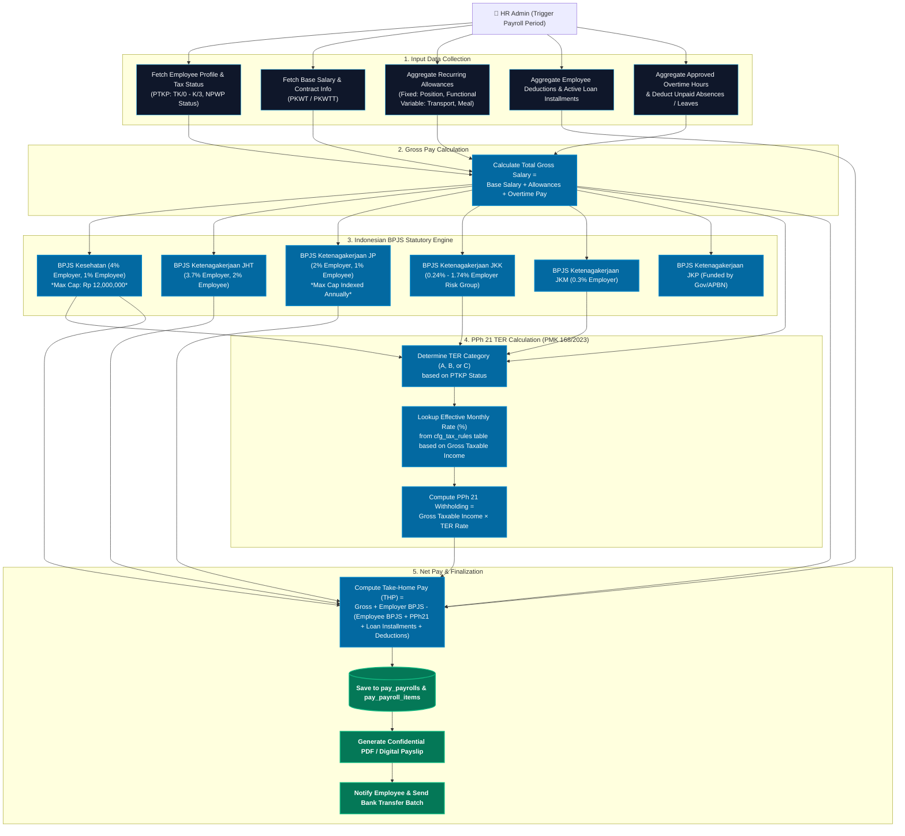
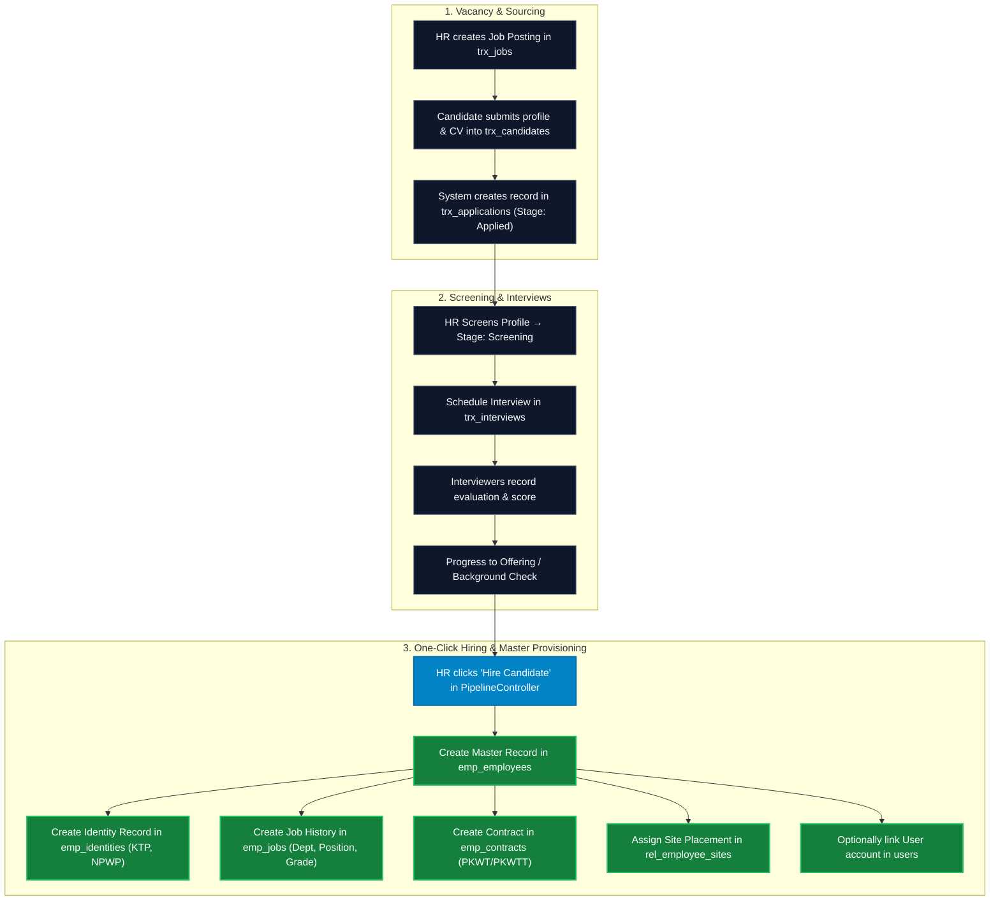
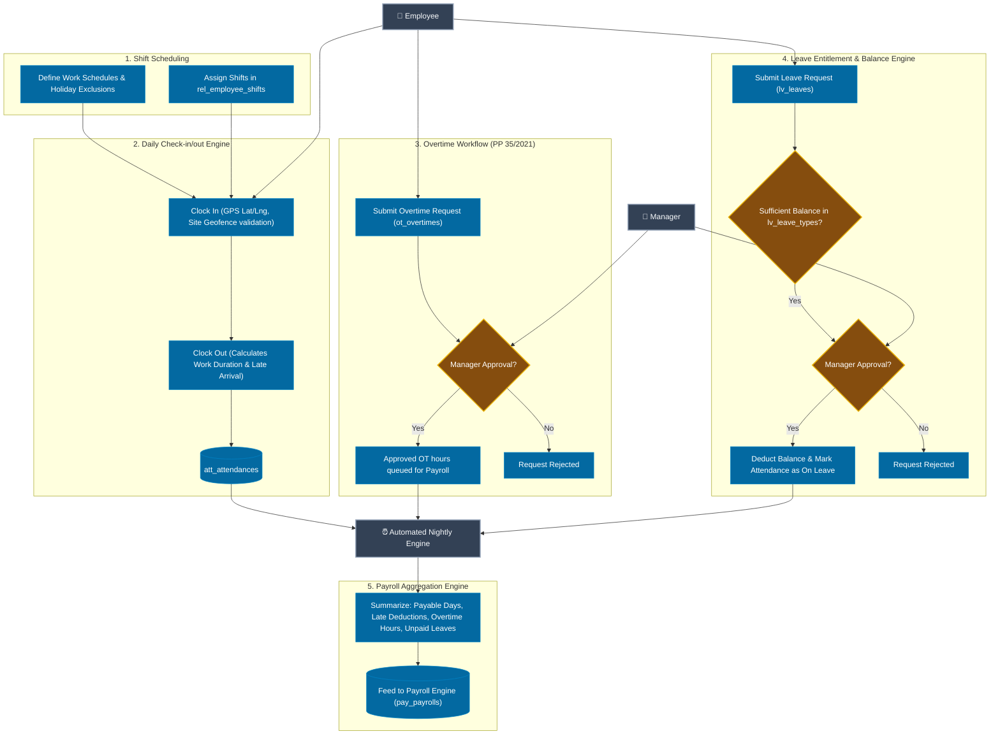

# HRIS SaaS — Data Flow Diagrams (DFD)

This document provides the complete Data Flow Architecture for the Indonesian HRIS SaaS application. It models data flows across **Level 0 (Context Diagram)**, **Level 1 (Core Subsystems & Data Stores)**, and **Level 2 (Deep-dive Operational Workflows)**.

---

## Quick Import Guides

### 1. Miro (`miro.com`)
1. Open your board in Miro.
2. In the left toolbar or command palette, search for the **Mermaid** app (or click **More tools (`+`) → Mermaid**).
3. Copy any of the Mermaid code blocks below and paste it into the Mermaid code editor.
4. Click **Generate** to render editable visual cards and arrows directly on your board.

### 2. Draw.io (`app.diagrams.net`)
- **Option A (Direct File Open)**: Open `docs/architecture/hris-data-flow-diagram.drawio` directly in [app.diagrams.net](https://app.diagrams.net/) via **File → Open From → Device**.
- **Option B (Mermaid Import)**: In Draw.io, go to **Arrange → Insert → Advanced → Mermaid**, paste the code block, and click **Insert**.

---

## 1. Level 0: System Context Diagram

The Context Diagram defines the system boundary, external entities interacting with the HRIS, and high-level input/output data flows.

```mermaid
flowchart TD
    %% External Entities
    EMP["👤 Employee / User"]
    HR["👔 HR Administrator / HR Manager"]
    MGR["👥 Department Manager / Supervisor"]
    CAND["💼 Job Candidate / Applicant"]
    VEND["🏢 Outsourcing Vendor / Supplier"]
    GOV["🏛️ Statutory & Tax Authorities<br/>(DJP PPh 21 / BPJS)"]
    SADMIN["⚙️ SaaS / Super Admin"]

    %% Central Process
    HRIS(("🏢 Indonesian HRIS<br/>SaaS Platform<br/>(Laravel + MySQL)"))

    %% Employee Flows
    EMP -->|"Self Check-in/out, GPS coordinates"| HRIS
    EMP -->|"Leave requests & Overtime claims"| HRIS
    EMP -->|"Personal profile updates & Document uploads"| HRIS
    HRIS -->|"Payslips, Shift roster, Leave balance"| EMP
    HRIS -->|"Attendance confirmation & Task notifications"| EMP

    %% HR Admin Flows
    HR -->|"Employee master records & Contracts (PKWT/PKWTT)"| HRIS
    HR -->|"Shift schedules, Holiday calendars & Work policies"| HRIS
    HR -->|"Salary components, Allowance & Deduction assignments"| HRIS
    HR -->|"Payroll run trigger & Final approval"| HRIS
    HRIS -->|"Payroll summary, Tax reports, Headcount analytics"| HRIS
    HRIS -->|"Compliance alerts & Contract expiry reminders"| HR

    %% Department Manager Flows
    MGR -->|"Leave & Overtime approvals"| HRIS
    MGR -->|"Performance reviews & 9-Box talent ratings"| HRIS
    MGR -->|"Shift roster adjustments & Training nominations"| HRIS
    HRIS -->|"Team attendance dashboard & Pending approval queue"| MGR

    %% Candidate Flows
    CAND -->|"Job applications, Resume & Profile details"| HRIS
    HRIS -->|"Application status & Interview invitations"| CAND

    %% Vendor Flows
    VEND -->|"Outsourced worker profiles & Assignment rosters"| HRIS
    VEND -->|"Vendor billing invoices & Proof of compliance"| HRIS
    HRIS -->|"Placement tracking, Timesheet summaries & Payment status"| VEND

    %% Government & Regulatory Flows
    HRIS -->|"PPh 21 TER monthly withholding reports (PMK 168/2023)"| GOV
    HRIS -->|"BPJS Kesehatan & Ketenagakerjaan wage contribution reports"| GOV
    HRIS -->|"PKWT contract registration records (PP 35/2021)"| GOV

    %% SaaS Admin Flows
    SADMIN -->|"Tenant setup, Plan provisioning & Feature permissions"| HRIS
    HRIS -->|"Tenant usage metrics, Subscription invoices & Error logs"| SADMIN

    classDef entity fill:#1e293b,stroke:#0284c7,stroke-width:2px,color:#f8fafc;
    classDef system fill:#0369a1,stroke:#38bdf8,stroke-width:3px,color:#ffffff,font-weight:bold;
    class EMP,HR,MGR,CAND,VEND,GOV,SADMIN entity;
    class HRIS system;
```

---

## 2. Level 1: Core Subsystems & Data Stores DFD

The Level 1 DFD decomposes the HRIS into 10 key operational processes and maps their bidirectional interactions with the 9 database table clusters.

```mermaid
flowchart TD
    %% External Entities
    subgraph ENTITIES ["External Entities"]
        E_EMP["👤 Employee"]
        E_HR["👔 HR Admin"]
        E_MGR["👥 Dept Manager"]
        E_CAND["💼 Candidate"]
        E_VEND["🏢 Outsourcing Vendor"]
        E_SAAS["⚙️ SaaS Admin"]
    end

    %% Subsystems / Processes
    subgraph PROCESSES ["Core HRIS Subsystems (Processes)"]
        P1["1.0<br/>Auth, RBAC &<br/>Tenant Control"]
        P2["2.0<br/>Organization &<br/>Structure Setup"]
        P3["3.0<br/>Employee Master &<br/>Lifecycle Mgmt"]
        P4["4.0<br/>Time, Attendance &<br/>Overtime Engine"]
        P5["5.0<br/>Leave Entitlement &<br/>Approval Workflow"]
        P6["6.0<br/>Indonesian Payroll &<br/>Statutory Engine"]
        P7["7.0<br/>Recruitment &<br/>Applicant Tracking (ATS)"]
        P8["8.0<br/>Talent, Performance &<br/>Succession Mgmt"]
        P9["9.0<br/>Outsourcing, Vendor &<br/>Compliance Mgmt"]
        P10["10.0<br/>SaaS Subscriptions &<br/>Billing Admin"]
    end

    %% Data Stores
    subgraph STORES ["Data Stores (MySQL Database)"]
        D1[("[(D1) sys_tenants, users, roles, permissions]")]
        D2[("[(D2) org_companies, sites, departments, positions]")]
        D3[("[(D3) emp_employees, identities, jobs, contracts, allowances, loans, tax_profiles]")]
        D4[("[(D4) att_shifts, rel_employee_shifts, att_attendances, ot_overtimes, cfg_schedules]")]
        D5[("[(D5) lv_leaves, lv_leave_types]")]
        D6[("[(D6) cfg_salary_components, cfg_bpjs, cfg_tax_rules, pay_payrolls, pay_payroll_items]")]
        D7[("[(D7) trx_jobs, trx_candidates, trx_applications, trx_interviews]")]
        D8[("[(D8) perf_reviews, nine_box_assessments, talent_pools, succession_plans, trainings]")]
        D9[("[(D9) rel_vendor_employees, outsourcing_compliance_records, bill_vendor_invoices]")]
    end

    %% Entity Interactions with Processes
    E_SAAS <-->|"Tenant provision & Plan config"| P10
    P10 <--> D1
    E_SAAS <-->|"User credentials & Role bindings"| P1
    P1 <--> D1

    E_HR -->|"Company, site & dept setup"| P2
    P2 <--> D2

    E_HR -->|"Employee profiles, PKWT/PKWTT contracts"| P3
    E_EMP -->|"Personal identity, family & bank updates"| P3
    P3 <--> D3
    P3 -.->|"Ref: Org metadata"| D2

    E_EMP -->|"Clock in/out, overtime requests"| P4
    E_MGR -->|"Approve overtime"| P4
    P4 <--> D4
    P4 -.->|"Ref: Employee shift & site"| D3

    E_EMP -->|"Submit leave request"| P5
    E_MGR -->|"Approve / Reject leave"| P5
    P5 <--> D5
    P5 -.->|"Verify balance against employee"| D3

    %% Cross-process to Payroll
    D3 -->|"Base salary, fixed allowances, deductions, loans"| P6
    D4 -->|"Payable attendance days, overtime hours"| P6
    D5 -->|"Unpaid leave deductions"| P6
    D6 -->|"BPJS rates, TER tax tables PMK 168/2023"| P6
    P6 -->|"Calculated payroll runs & payslip line items"| D6
    E_HR -->|"Execute payroll run & lock batch"| P6
    P6 -->|"Generate payslips"| E_EMP

    %% Recruitment ATS
    E_HR -->|"Create job vacancy"| P7
    E_CAND -->|"Submit application & resume"| P7
    E_MGR -->|"Submit interview scorecards"| P7
    P7 <--> D7
    P7 -->|"Onboard hired candidate → Create master profile"| P3

    %% Talent Management
    E_MGR -->|"Performance ratings & 9-Box grid evaluation"| P8
    E_HR -->|"Succession planning & training assignments"| P8
    P8 <--> D8
    P8 -.->|"Ref: Employee performance history"| D3

    %% Outsourcing & Vendor Placements
    E_VEND -->|"Submit outsourced worker roster & Invoices"| P9
    E_HR -->|"Audit labor law compliance & verify billing"| P9
    P9 <--> D9
    P9 -.->|"Cross-reference site placement"| D2

    classDef proc fill:#0284c7,stroke:#0369a1,stroke-width:2px,color:#ffffff,font-weight:bold;
    classDef store fill:#0f766e,stroke:#14b8a6,stroke-width:2px,color:#ffffff;
    classDef ent fill:#334155,stroke:#94a3b8,stroke-width:2px,color:#f8fafc;

    class P1,P2,P3,P4,P5,P6,P7,P8,P9,P10 proc;
    class D1,D2,D3,D4,D5,D6,D7,D8,D9 store;
    class E_EMP,E_HR,E_MGR,E_CAND,E_VEND,E_SAAS ent;
```

---

## 3. Level 2: Detailed Workflow DFDs

### 3.1 DFD 2.1 — Indonesian Payroll & Statutory Calculation Engine
*Complies with Indonesian Labor Law (UU Cipta Kerja), Tax Regulation PMK 168/2023 (PPh 21 TER), and BPJS regulations.*

---

### 3.2 DFD 2.2 — Recruitment Pipeline to Employee Onboarding Flow

---

### 3.3 DFD 2.3 — Attendance, Shift Roster & Leave Processing Flow

---

## 4. Entity-Process-Data Store Mapping Matrix

| Process # | Process Name | Primary Entities | Key Input Data | Read Stores | Write Stores | Key Output Data |
|---|---|---|---|---|---|---|
| **1.0** | Auth & RBAC | SaaS Admin, All Users | Login credentials, Role permissions | `D1 (sys_)` | `D1 (sys_)` | JWT / Session Token, Nav permissions |
| **2.0** | Org Setup | HR Admin | Companies, Sites, Depts, Positions | `D2 (org_)` | `D2 (org_)` | Org Chart, Master structural metadata |
| **3.0** | Employee Lifecycle | HR Admin, Employee | Personal info, KTP/NPWP, Family, Bank, PKWT/PKWTT contracts | `D2, D3` | `D3 (emp_)` | Master profile, Document archive, Reminders |
| **4.0** | Attendance & Overtime | Employee, Manager | Clock-in/out, GPS coordinates, Overtime forms | `D3, D4` | `D4 (att_, ot_)` | Timesheets, Overtime pay hours, Tardiness |
| **5.0** | Leave Management | Employee, Manager | Leave dates, Medical certificates, Approvals | `D3, D5` | `D5 (lv_)` | Leave calendar, Remaining balance |
| **6.0** | Payroll Engine | HR Admin, Employee | Pay period trigger, Allowances, Loan cuts, Overtime | `D3, D4, D5, D6`| `D6 (pay_)` | PPh 21 TER, BPJS breakdown, Net Payslips |
| **7.0** | Recruitment (ATS) | Candidate, HR, Interviewer| Job postings, Resumes, Interview scorecards | `D2, D7` | `D7 (trx_), D3`| Hire action, Onboarded employee record |
| **8.0** | Talent & Succession | Dept Manager, HR Admin | Performance review criteria, 9-Box grid matrix | `D3, D8` | `D8 (talent_)`| High-potential pool, Succession chart |
| **9.0** | Outsourcing & Vendor | Vendor, HR Admin | Vendor placements, Billing invoices, Compliance logs | `D2, D9` | `D9 (vendor_)`| Placement tracking, Verified invoices |
| **10.0** | SaaS Administration | SaaS Admin | Subscription plans, Tenant billing, Bug tickets | `D1, D10` | `D1, D10` | Tenant access status, Payment receipts |

---

## 5. File Artifacts Generated

1. **`docs/architecture/data-flow-diagram.md`** *(this file)*: Markdown documentation with Mermaid syntax for Miro and direct rendering.
2. **`docs/architecture/hris-data-flow-diagram.drawio`**: Multi-page Draw.io diagram file compatible with [app.diagrams.net](https://app.diagrams.net/).
